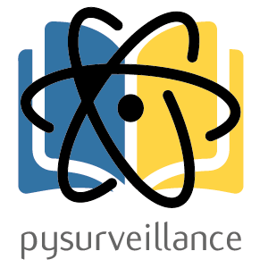

# pysurveillance

<center></center>

## Installation

- Clone the repository

```bash
git clone https://github.com/JulenCestero/pysurveillance.git
cd pysurveillance
```

- (Optional) Create new python virtual environment

```bash
python3 -m venv venv
source venv/bin/activate
```

- Install requirements

```bash
pip install -r requirements.txt
```

- Create a `config.json` file which contains the API key to [your Scopus account](https://dev.elsevier.com/apikey/manage) and place it in the root folder of this repository:

```json
{
    "api-key": "YOUR_API_KEY"
}
```

- Run the script with

```bash
streamlit run streamlit_show.py
```

## Docker

Build the project image:

```bash
docker build --tag py-surveillance:<tag> .
```

To run the project:
```bash
docker run --publish 8501:8501 --detach --name py-surveillance py-surveillance:<tag>
```

## Usage

There are two methods of analyzing the data: getting a *csv* file from Scopus and searching the results from the streamlit interface.

### Importing the csv from a Scopus export

- You first need a csv file from [Scopus](https://www.scopus.com/search/form.uri?display=basic) with the results of a query of 300-600 papers.
- Upload the csv to streamlit


### Searching with the search box of the Streamlit interface

- Write your query in the text box using the [Scopus syntax](https://dev.elsevier.com/tips/ScopusSearchTips.htm). Control + Enter for executing the query.
- The number of results of that query will appear below. Try to get a number of results between 400 and 800. If the number of results is good enough, click the button to retrieve all the results from scopus. Depending on the number of results, this action may require a couple of minutes.
- The analysis of the results will appear on screen.
- You can filter the years of the results using the slide of the left side.


