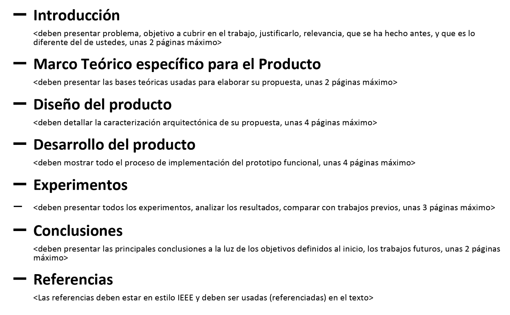
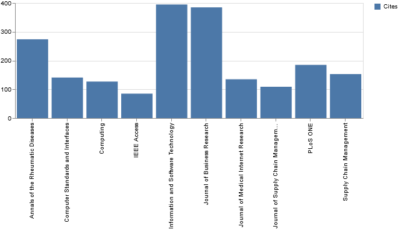
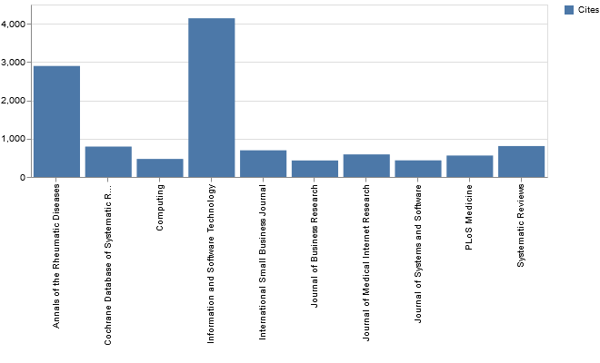

# Organización Pysurveillance 5/08/2020

## Introducción

Este documento interno recoge los primeros pasos para la organización de la redacción del paper correspondiente a la herramienta *pysurveillance*. Se discutirán asuntos relacionados con la estuctura del paper, así como el contenido esperado en cada apartado de la estructura, se sugerirá una asignación de secciones a los distintos colaboradores del paper y, finalmente, se proponen unos journals donde sería posible publicarlo, en base a la repercusión de papers similares. Como nota, lo descrito en este documento debe tomarse como ideas o sugerencias, por lo que todo está abierto a sugerencias o cambios.

## Estructura del paper

La estructura principal que seguiría el paper se corresponde con la estructura recogida en el Google Drive del proyecto por Elizabeth, mostrada en la siguiente imagen.

- **Introducción** (alrededor de 1 hoja): la descripción de la imagen para este apartado me parece adecuada. Dividiría esta sección en dos apartados. Se comentaría el contexto, la justificación y relevancia del proyecto. En qué consiste una vigilancia tecnológico, definir conceptos... **Marco teórico (IGUAL LO INTEGRAMOS EN LA INTRODUCCIÓN)** (alrededor de 2 hojas): en este apartado se tratará la investigación teórica que Alex y Francisco hicieron en su día sobre los tipos de estudio de literatura (SLR, SMS, etc.). Además de esto, se incluirá la metodología seguida por David para realizar esta búsqueda sistematizada de una manera teórica.
- **Estado del arte**. Se especificaría trabajo relacionado y fuentes de inspiración que hayamos podido tener para la realización de este proyecto.
- **Diseño del producto** (alrededor de 4 hojas): este apartado contará con varios esquemas e imágenes que detallan la arquitectura del sistema. Este punto deberá explicar el proceso de la aplicación, cómo consigue los datos, de qué fuentes, y todo el procesamiento de datos que realiza para mostrar las gráficas de los análisis de distintos niveles. Tendrá que explicar las dos opciones que se incluyen en la aplicación, la de procesar *csv* y la de recoger los datos directamente desde la API de Scopus. Por otro lado, no estoy seguro si añadir el apartado de recoger los cuartiles de cada artículo en su momento, aunque imagino que sí, que aunque aún no esté del todo integrado con el resto de la aplicación, es un proceso muy útil. Además, mencionar el procedimiento de cacheado de la aplicación, tanto la de *Streamlit* como la que realizamos de forma personalizada en la aplicación para búsquedas que ya existan.
- **Desarrollo del producto** (alrededor de 2 hojas): este apartado contará el procedimiento que se siguió para realizar la aplicación. Se empezará desde la definición teórica de David, pasando por la adaptación de la metodología a código, y finalizando por las tareas realizadas por Alex y Francisco. Se pueden mencionar tareas a futuro.
- **Experimentos** (alrededor de 2 hojas): se mostrarán ejemplos prácticos de uso de la aplicación, así como imágenes y gráficas que demuestren su utilidad. Para ello, se mostrarán una o dos ecuaciones de búsqueda y se mostrarán ejemplos de la aplicación con el método de procesar los *csv* y el de recoger los datos desde la API.
- **Conclusiones** (alrededor de 1 hoja): se concluirá que los objetivos propuestos en la introducción han sido cubiertos satisfactoriamente y se recapitulará con qué se ha hecho en este proyecto concretamente y cuales serán los pasos a futuro.

## Asignación de secciones

En esta sección mencionaré una sugerencia de separación de tareas, aunque estoy abierto a sugerencias y a cualquier cambio que se crea conveniente.

- **Introducción**: este apartado podría realizarlo Elizabeth, ya que conoce el contexto del proyecto a la perfección y ha estado coordinando desde el inicio el proyecto, por lo que podrá mostrar una visión más general que el resto de nosotros.
- **Marco teórico**: este apartado creo que tiene dos partes, la investigación realizada por Alex y Francisco y la metodología de David. Por tanto, creo que esta sección podría dividirse en dos personas, Elizabeth podría encargarse de la parte que investigaron Alex y Francisco, ((((mientras que David podría definir la metodología que usamos en la aplicación, que tiene de base teórica una asignatura de Eafit que no recuerdo el nombre.))))
- **Diseño del producto**: de este apartado puedo encargarme yo, ya que sería definir internamente la aplicación y los procedimientos usados para optimizar los procesos internos. 
- **Desarrollo del producto**: este apartado puedo encargarme yo también, ya que el desarrollo inicial de la aplicación corrió a mi cargo, aunque para esta sección igual necesitaría consultar algunos detalles, o que alguien me verifique que el desarrollo que no hice yo está correctamente definido.
- **Experimentos**: había pensado que para esta sección, el más indicado podría ser David, ya que esta sección sería la aplicación práctica de la metodología que él definirá en el marco teórico, y se puede referenciar a sí mismo sin problema. Comparar el software con la metodología de Excel manual. Demostrar que hace en menos tiempo.
- **Conclusiones**: no estoy seguro de que la carga de trabajo de cada integrante esté balanceada, por lo que este apartado prefiero discutirlo en persona antes de asignárselo a nadie. Aun y todo, esta sección es probablemente la última que escribamos y la que menos trabajo requerirá, porque recogerá toda la información que hemos detallado a lo largo del resto de la publicación.

## Journals para publicar

Finalmente, en esta sección comentaré la investigación sobre los posibles journals en los que este paper podría ser publicado. Para obtener la información, he utilizado la propia herramienta *pysurveillance* para encontrar los journals más citados en el estado del arte y, por tanto, encontrar los mejores candidatos para nuestra publicación. En las siguientes imágenes, se pueden ver los 10 journals más citados en diferentes rangos de años.

- Top Journals 2017-2020

- Top Journals 1980-2020

Se puede observar que en ambas imágenes, hay un journal que aparece destacado como el más citado. Este journal es [Information and Software Technology](https://www.editorialmanager.com/INFSOF/default.aspx), y creo que debería ser el primero en el que intentemos publicar. El resto de journals se salen del campo de estudio, siendo éstos de ámbitos médicos o empresariales, más que de software. Por tanto, este journal sería, desde mi punto de vista, el principal journal al que deberíamos apuntar.

http://www.guide2research.com/conference/ease-2020

Diseño del producto + Desarrollo de producto = Diseño del experimento
Experimentos = Resultados

Añadir la definición de la metodología de David en el Diseño del experimento

Añadir en resultados tiempo con excel vs tiempo con aplicación

Resultados: dos partes. la parte de David del Excel, y todo el proceso lo hace David. Yo apoyo con los analisis de mas alto nivel y el definir estas cosas de la aplicacion en si. Pero lidera David

Eli se encarga de intro y todo lo teórico

En diseño del experimento lidero yo, pero Eli me apoya con la parte teórica

Coger el overleaf de David y poner las secciones que hemos hablado ahora y comentarios sobre qué meter en cada apartado

Primero intentar ir a conferencia, y luego a un journal